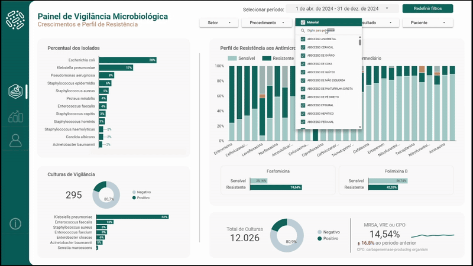
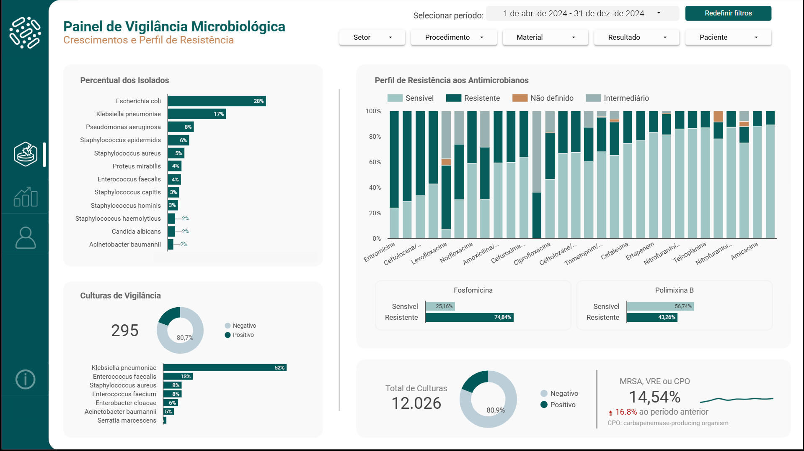
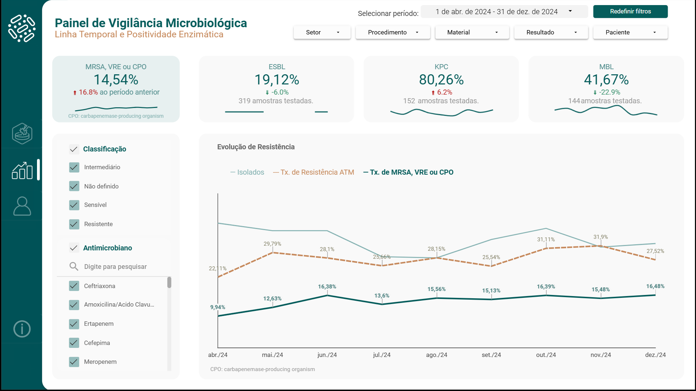

# Dashboard de Vigilância Microbiológica

### 📊 [Acesse o Dashboard Interativo Aqui](https://lookerstudio.google.com/reporting/ba5fd882-81a3-44ae-8493-b08685aeadb0)

---

## 📄 Sobre o Projeto

Este projeto nasceu de uma idealização do Dr. Luis Visconde, médico infectologista e, durante o desenvolvimento do relatório original (06/2024), responsável por dois Serviços de Controle de Infecções Relacionadas à Assistência à Saúde (SCIRAS).

Ele identificou uma lacuna crítica comum a muitas instituições hospitalares: embora os dados de crescimento microbiológico representem um valioso ativo para a vigilância epidemiológica, eles são frequentemente subutilizados. Essa falta de uma visão centralizada resultava em desafios práticos significativos:

* Visibilidade limitada sobre as taxas de positividade e o perfil de isolados por setor.
* Dificuldade no monitoramento de agentes resistentes e suas tendências ao longo do tempo.
* Atraso na percepção de aumentos na frequência de certos patógenos ou mudanças no padrão de resistência.

Sem uma ferramenta de visualização unificada, a vigilância epidemiológica tornava-se um processo reativo e manual, em vez de proativo e orientado por dados.

Para solucionar essa lacuna, assumi o desafio de desenvolver uma ferramenta de visualização de dados. Fui responsável pela condução de todas as etapas do processo: desde o tratamento e modelagem dos dados brutos extraídos do sistema laboratorial (baseado nos sistemas Shift), ao design e implementação do dashboard, possibilitando:

* **Vigilância ativa de indicadores:** Acompanhar a evolução mensal das taxas de positividade das culturas e dos índices de resistência antimicrobiana, identificando tendências e desvios do padrão esperado de forma clara e visual.
* **Identificar ameaças clínicas:** Mapear os isolados de maior relevância clínica no ambiente hospitalar e a prevalência de mecanismos de resistência enzimática (como KPC, MBL, ESBL).
* **Suporte à decisão clínica e gerencial:** Investigar o histórico de culturas de um paciente específico para apoiar decisões de tratamento individuais, ao mesmo tempo em que se analisa a distribuição de perfis de resistência por setor ou tipo de amostra, revelando possíveis focos de infecção.
* **Acesso à Informação:** Substituir a análise manual e demorada de laudos por uma plataforma visual e interativa, garantindo que informações críticas estivessem sempre acessíveis e atualizadas.

---

## 🛠️ Metodologia e Tecnologias

* **Google Looker Studio:** Ferramenta principal para desenvolvimento, visualização e interatividade do dashboard.
* **Análise e Tratamento de Dados:** Utilização de estatística e técnicas de mineração de texto para extrair e estruturar informações dos dados laboratoriais brutos.
* **Implementação de Regras Epidemiológicas:** Conversão de critérios clínicos e de vigilância em métricas-chave (ex: taxas de positividade, perfis de resistência) através de campos calculados e lógica condicional no Looker Studio.
* **Fonte de Dados:** Simulação de dados a partir de uma estrutura baseada em sistemas laboratoriais (Shift), utilizando Google Sheets como base de dados.

---

## 🖼️ Telas do Dashboard

**Tela de Crescimentos e Perfil de Resistência**

**Tela de Análise Temporal e Positividade Enzimática**

**Tela de Resultados por Paciente**

> **Nota sobre os Dados:** Este dashboard é uma demonstração de portfólio inspirada em uma solução real, desenvolvida e implementada em ambiente hospitalar. Os dados aqui exibidos foram gerados artificialmente para simular a realidade de uma instituição de saúde, não representando, portanto, nenhum hospital real e servindo exclusivamente para fins de exemplificação.

---

## 👨‍💻 Contato

* **LinkedIn:** https://www.linkedin.com/in/kvpergentino/
* **GitHub:** https://github.com/kvpergentino
